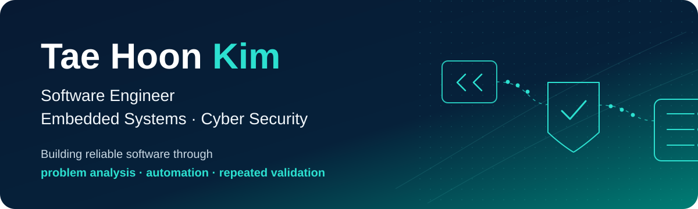
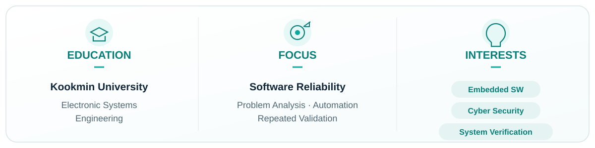

  

 

&nbsp;&nbsp;&nbsp;&nbsp;

 

  

 

---

## 📌 Work

### Security

#### [Security Incident Report](https://github.com/kevin9480/Security_incident_report)

DFIR · Incident Response · React2Shell RCE Analysis · Wazuh/Sysmon/Coraza WAF

 

#### [Linux Vulnerability Automation](https://github.com/kevin9480/Linux_vuln_automation)

Linux Security Automation · Ansible · Shell

 

#### [AWS DevSecOps Security Automation](https://github.com/kevin9480/Aws_devsecops_security_automation)

Cloud Security · OIDC · IaC · CI/CD

 

### Embedded / Control

#### [UWB Logistics Robot](https://github.com/kevin9480/UWB_logistics_robot)

Embedded System · UWB Localization · Path Planning

 

#### [NMPC Garrett Project](https://github.com/kevin9480/NMPC_garrett_project)

NMPC Control · Hybrid Vehicle Optimization · Simulation

 

---

## 🧩 Experience

### Hyundai AutoEver Mobility SW School — IT Security

**RAPA · Dec 2025 — Jun 2026 · 1,000 Hours**

> System Security · Cloud Security · Penetration Testing · Incident Response

 

### Kookmin University — Electronic Systems Engineering

**B.S. · Mar 2019 — Feb 2026**

 

### 🏆 Awards

<table>
<tr>

<td width="50%" valign="top">

<b>🏆 Excellent Paper Award</b>

한국전자파학회

UWB-based Autonomous Logistics Robot

Aug 2024

</td>

<td width="50%" valign="top">

<b>🏆 Excellence Award · 2nd Place</b>

Garrett Motion Korea

NMPC Controller Design Competition

Dec 2024

</td>

</tr>
</table>

 

---

## 🛠️ Tools

### Languages

  
  
  
  
  

### Security & Infrastructure

  
  
  
  

### Cloud & DevOps

  
  
  
  

